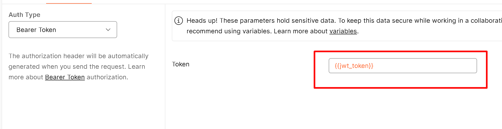

# Reto de Programación en Java para UTP

Este documento describe la solución implementada para el reto de programación solicitado por UTP.

### Resumen del Reto
Este reto consistió en el desarrollo de una API REST en Java utilizando el framework Spring Boot con un enfoque en arquitectura hexagonal y principios de Domain-Driven Design (DDD). Se implementó utilizando una arquitectura hexagonal basada en principios de Domain-Driven Design (DDD). La API proporciona funcionalidades de autenticación, gestión de notas, y manejo centralizado de excepciones. También se aplicaron varios patrones de diseño como el Repositorio, Comando, Fábrica, y el Patrón Mediador, asegurando un diseño modular y escalable.


### Diagrama de arquitectura


#### Adaptadores Primarios (Entradas):
Manejan la interacción con el mundo exterior, como interfaces de usuario o API externas, actuando como puntos de entrada a la aplicación.

#### Aplicación (Servicios):
Contiene la lógica de negocio y coordina las operaciones del sistema. Los servicios en esta capa utilizan los puertos para interactuar con el dominio y los adaptadores secundarios.

#### Dominio (Núcleo):
Representa el núcleo de la lógica de negocio, donde residen las reglas de negocio fundamentales y las entidades que modelan el comportamiento del sistema.

#### Adaptadores Secundarios (Salidas):
Se encargan de la interacción con tecnologías externas, como bases de datos, sistemas de mensajería o APIs de terceros. Son implementaciones concretas de los puertos secundarios.

#### Cross-Cutting Concerns (Asuntos Transversales):
Incluye funcionalidades compartidas y reutilizables en múltiples partes de la aplicación, como validaciones, utilidades comunes o mediadores de mensajes.

#### Configuraciones:
Define las configuraciones globales del sistema, como seguridad, gestión de APIs o cualquier otra configuración relacionada con el entorno de ejecución.


### Casos de Uso cubiertos


#### Registrar Usuario: 
El usuario proporciona sus datos (nombre de usuario, email, contraseña) para crear una nueva cuenta en el sistema.

#### Obtiene Token JWT: 
Después de registrarse o iniciar sesión, el usuario obtiene un token JWT, que será utilizado para acceder a recursos protegidos en el sistema.

#### Crear Nota con Token Válido: 
El usuario envía un título y contenido de una nota, utilizando el token JWT previamente obtenido para autorizar la creación de la nota.

#### Listar Notas con Token Válido: 
El usuario, usando el token JWT, puede ver todas las notas que ha creado en el sistema.

### Diagrama de Secuencia


Este diagrama de secuencia ilustra los principales casos de uso para una aplicación que maneja el registro de usuarios, autenticación mediante JWT, y la gestión de notas (creación y listado).

---

#### Registro de Usuario:

1. El usuario envía una solicitud de registro al sistema.
2. La API redirige la solicitud al Servicio de Autenticación para validar si el usuario ya existe.

##### Alternativa 1: 
- Si el usuario ya está registrado, se genera un error y la API responde al usuario con un mensaje de error indicando que el usuario ya existe.

##### Alternativa 2: 
- Si el usuario no existe, el Servicio de Autenticación guarda el nuevo usuario en la Base de Datos.
- Una vez registrado, se confirma el registro y la API devuelve una respuesta exitosa al usuario.

---

#### Iniciar Sesión:

1. El usuario inicia sesión proporcionando sus credenciales (nombre de usuario y contraseña).
2. La API redirige las credenciales al Servicio de Autenticación para validarlas.

##### Alternativa 1: 
- Si las credenciales son inválidas, la API responde con un error al usuario.

##### Alternativa 2: 
- Si las credenciales son válidas, el Servicio de Autenticación consulta la Base de Datos para recuperar la información del usuario y genera un Token JWT, que es devuelto al usuario a través de la API.

---

#### Crear Nota:

1. El usuario intenta crear una nota proporcionando un token JWT válido.
2. La API envía el token al Servicio de Autenticación para validarlo.

##### Alternativa 1: 
- Si el token es inválido, la API responde con un error al usuario.

##### Alternativa 2: 
- Si el token es válido, el Servicio de Autenticación confirma la validez del token y la API procede a enviar los datos al Servicio de Notas para crear la nota.
- La nota se guarda en la Base de Datos, y la API responde al usuario con una confirmación de creación exitosa.

---

#### Listar Notas:

1. El usuario solicita listar todas las notas creadas utilizando un token JWT.
2. La API envía el token al Servicio de Autenticación para su validación.

##### Alternativa 1: 
- Si el token es inválido, la API responde con un error al usuario.

##### Alternativa 2: 
- Si el token es válido, la API consulta el Servicio de Notas, que a su vez obtiene las notas del usuario desde la Base de Datos. Finalmente, la API responde al usuario con la lista de notas obtenida.
### Modelo de Datos


El reto técnico tiene como objetivo implementar una API REST que gestione usuarios y notas, con funcionalidades de autenticación y autorización, utilizando Spring Boot y JWT para asegurar los endpoints. La base de datos debe permitir que los usuarios solo puedan acceder a sus propias notas, y se debe validar y manejar correctamente los datos de entrada.

#### Justificación de la Relación

##### **Entidad `users`:**
- Cada usuario tiene un identificador único `id` (clave primaria), junto con otros atributos como `username`, `email` y `password`.

##### **Entidad `notes`:**
- Las notas tienen su propio identificador único `id`, junto con atributos como `title`, `content`, y `createdAt`. 
- El campo `user_id` es una clave foránea que apunta a la clave primaria `id` en la tabla `users`.

##### **Usuarios y Notas**: 
- Cada usuario puede tener múltiples notas, y cada nota está asociada a un solo usuario. Esto se modela de forma eficiente en la base de datos utilizando una clave foránea `user_id` en la tabla `notes`.

##### **Cumplimiento de Funcionalidades**: 
- El modelo cumple con las funcionalidades básicas del reto, como la creación y el listado de notas asociadas a un usuario, y la protección de los datos a través de la autenticación y autorización con JWT.

#### Relación en PlantUML:
El símbolo adecuado en **PlantUML** para una relación uno a muchos es `|o--o{`, donde:
- `|o` representa la **cardinalidad uno** en el lado del usuario.
- `o{` representa la **cardinalidad muchos** en el lado de las notas.


### Patrones Usados
#### Patrón de Repositorio

**Descripción**:  
Permite la separación entre la lógica de acceso a los datos y la lógica del negocio, proporcionando una abstracción de la capa de persistencia.

**Código**:  
- `NoteRepository`, `UserRepository` definen los contratos.  
- `NoteRepositoryImpl`, `UserRepositoryImpl` implementan los contratos utilizando `JpaNoteRepository` y `JpaUserRepository`.

---

#### Patrón Mediador

**Descripción**:  
Centraliza la lógica de ejecución de comandos y consultas para evitar que las clases de aplicación interactúen directamente con el dominio o los repositorios.

**Código**:  
- `MediatorService` implementa el patrón mediador despachando los comandos y consultas hacia sus respectivos manejadores.

---

#### Patrón de Comando

**Descripción**:  
Encapsula la información necesaria para realizar una acción. Esto permite separar las solicitudes de acciones de la ejecución real de las mismas.

**Código**:  
- `CreateNoteCommand`, `CreateUserCommand` encapsulan las acciones de creación.  
- `CreateNoteCommandHandler`, `CreateUserCommandHandler` son los manejadores que ejecutan los comandos.

---

#### Patrón Fábrica

**Descripción**:  
Permite la creación de objetos sin especificar el tipo exacto de los objetos que se crearán.

**Código**:  
- `NoteMapper`, `UserMapper` son fábricas que convierten entidades de dominio a entidades de persistencia y viceversa.

---

#### Patrón DTO (Data Transfer Object)

**Descripción**:  
Utilizado para transferir datos entre las capas de la aplicación sin exponer las entidades de dominio directamente.

**Código**:  
- `NoteCreateRequestDTO`, `UserRegisterRequestDTO`, `ApiResponseDTO` encapsulan los datos de entrada y salida.

---

#### Patrón Singleton

**Descripción**:  
Garantiza que una clase tenga una única instancia y proporciona un punto global de acceso a ella.

**Código**:  
- `JwtTokenProvider` es una clase `@Component` manejada por Spring que actúa como singleton para gestionar los tokens JWT.

---

#### Patrón de Seguridad (JWT)

**Descripción**:  
Implementa la autenticación basada en tokens JWT para proteger las rutas de la API.

**Código**:  
- `JwtTokenProvider`, `JwtTokenFilter` manejan la creación, validación y uso de tokens JWT para proteger los endpoints.


#### Instrucciones para ejecutar el proyecto

##### 1. Clonar el repositorio
##### 2. Crear la iamgen 
```
docker build -t utp-api .
```
##### 3. Ejecutar la imagen en el puerto 8083
```
docker run -d -p 8083:8083 --name utp-api-container utp-api
```
##### 5. Probar con la sigueinte ruta con Swagger
[http://localhost:8083/swagger-ui/index.html](http://localhost:8083/swagger-ui/index.html)

##### 4. Probar con collection de Postman
```
utp-api\recursos\UTP_RETO_COLLECTION.postman_collection.json
```

#### Evidencia de ejecución:




#### Test de Aceptación


#### Pruebas unitarias


---
Autor: Arturo Eduardo Fajardo Gutiérrez
Correo: efajardogutierrez@hotmail.com
